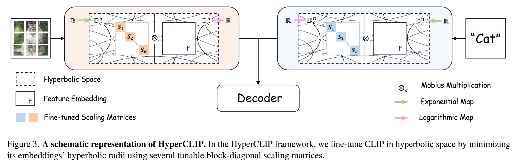

# Understanding Fine-tuning CLIP for Open-vocabulary Semantic Segmentation in Hyperbolic Space

<p align="center">
  
</p>

This repository provides the official implementation of our **CVPR 2025** paper:

We explore a principled fine-tuning strategy for CLIP in **hyperbolic space** to support open-vocabulary semantic segmentation. Our approach leverages:

- **Radius-aware transformation** of CLIP embeddings to encode hierarchical structures.
- A **dual cross-modality communication module** to align vision and language features at fine granularity levels.
- An efficient fine-tuning pipeline without the need for box-level annotations.

# Installation and Data Preparation

Please refer to the [CAT-Seg](https://github.com/cvlab-kaist/CAT-Seg) repository for guidance on:

- Environment setup (Python version, dependencies, etc.)
- Dataset preparation (e.g., COCO, ADE20K, Pascal VOC)

# Training and Evaluation

You can launch the entire training and evaluation pipeline using:

```bash
bash run_train_test.sh


# Acknowledgement
Thanks to the excellent works and their codebases of [CAT-Seg](https://github.com/cvlab-kaist/CAT-Seg). 

# Citation
Please consider citing our paper if the code is helpful in your research and development.
```
@inproceedings{peng2025understanding,
  title={Understanding Fine-tuning CLIP for Open-vocabulary Semantic Segmentation in Hyperbolic Space},
  author={Peng, Zelin and Xu, Zhengqin and Zeng, Zhilin and Wen, Changsong and Huang, Yu and Yang, Menglin and Tang, Feilong and Shen, Wei},
  booktitle={Proceedings of the Computer Vision and Pattern Recognition Conference},
  pages={4562--4572},
  year={2025}
}
```
